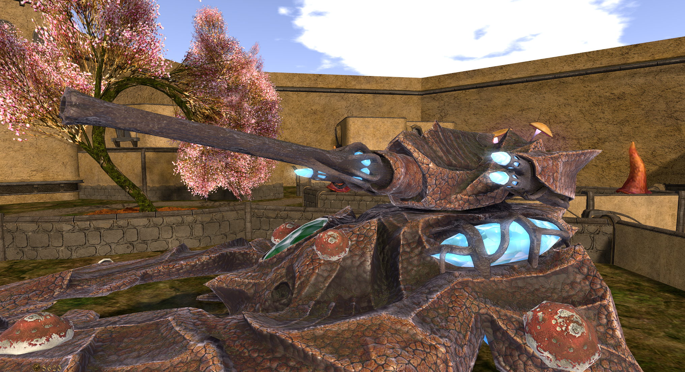
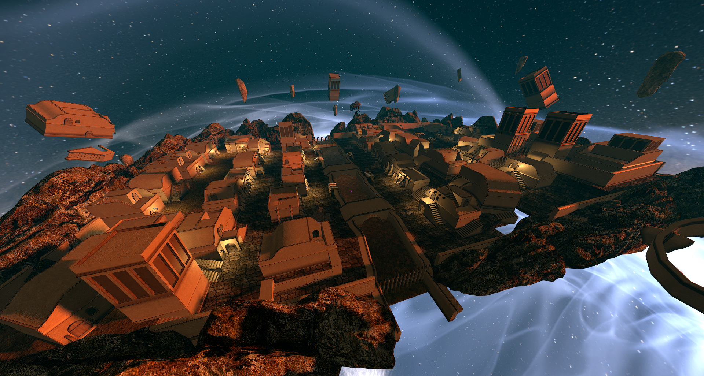

  

# Ashguard Meeting Notes — May 2026

*Heylo and welcome to June, Ashguardians. Today's meeting is a snappy one; really just the preamble to a raid with some promotions and a few tidbits, as there have been no major events to discuss.*

---

## College of Artifice Update

### Veloth's Judgement Autocannon

We have a new autocannon for Veloth's Judgement. It is exactly as it sounds and will likely do wonders against infantry and help a great deal when fighting fast-moving targets. This does nullify the beetle's use case somewhat, but that was a long time coming.

### Dwemer Tuning Fork (Coming Very Soon)

The Dwemer tuning fork will be out very soon. I had hoped to release it today, but there were bugs in the viewer animation exports, so a full release has been delayed. The purpose of the fork is to destroy mines and the like as an offhand. It also doubles as a melee weapon thanks to its spiky bits, and it can be paired with the shield or other Layer 2 right-hand weapons.

Thanks to Shiri for the model.

### Glass Katana (In Development)

Skull and Adama are still working on the new glass katana melee. It is in turn waiting on the in-progress HUD update, which will let our stamina work like our magicka as a usable resource.

### New Sky Build

I also have a new build up in the sky, which is basically Morrowind's Balmora. It is intended for the smaller, faster combat raids of the partial-damage variety.

---

## Promotions

| Member  | Promotion |
| ------- | --------- |
| Carrots | E-1 → E-2 |
| Phan    | E-4 → E-5 |
| Skull   | E-5 → E-6 |
| Fox     | E-6 → E-7 |

---

## Merits

🏅 <b>Merit Awards</b> 🏅

Soap is setting up the shelves for these. I think we can start letting people collect their merit tags from the armory this week, and shortly thereafter the system should be able to track the numbers so we can automatically award merit achievers. In the meantime, however:

> ### 🎖️ Apprentice Pointman
> 
> **Awarded to: Carrots**
> 
> For continued flag capturing at the Badlands, where he has been fighting the locals for a spot on their leaderboard. Good work, Carrots.

---

*Thank you for coming, everyone!*

