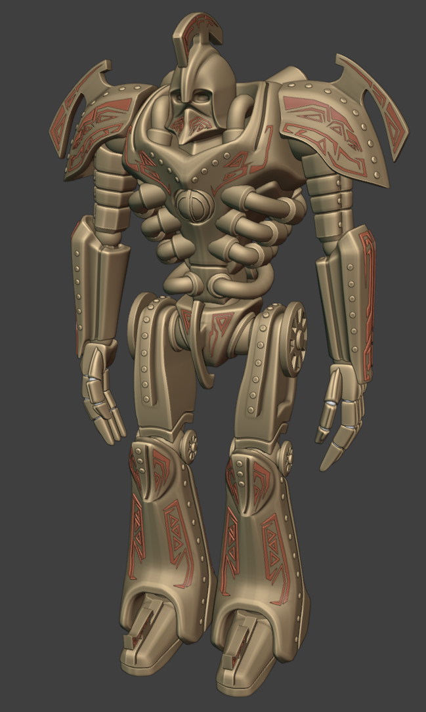
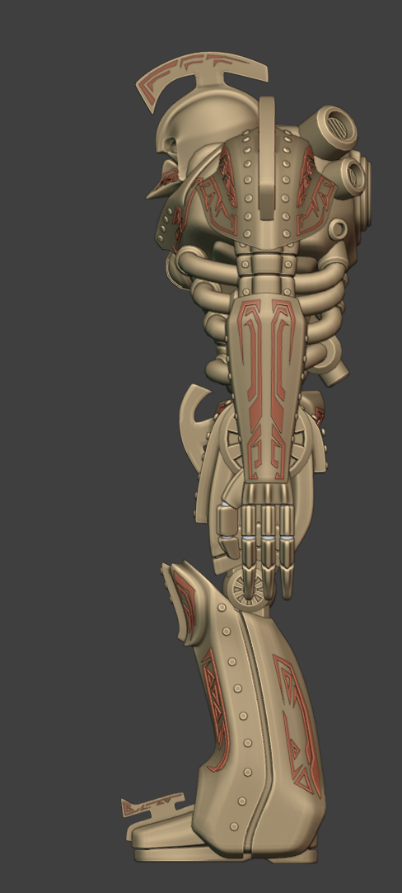
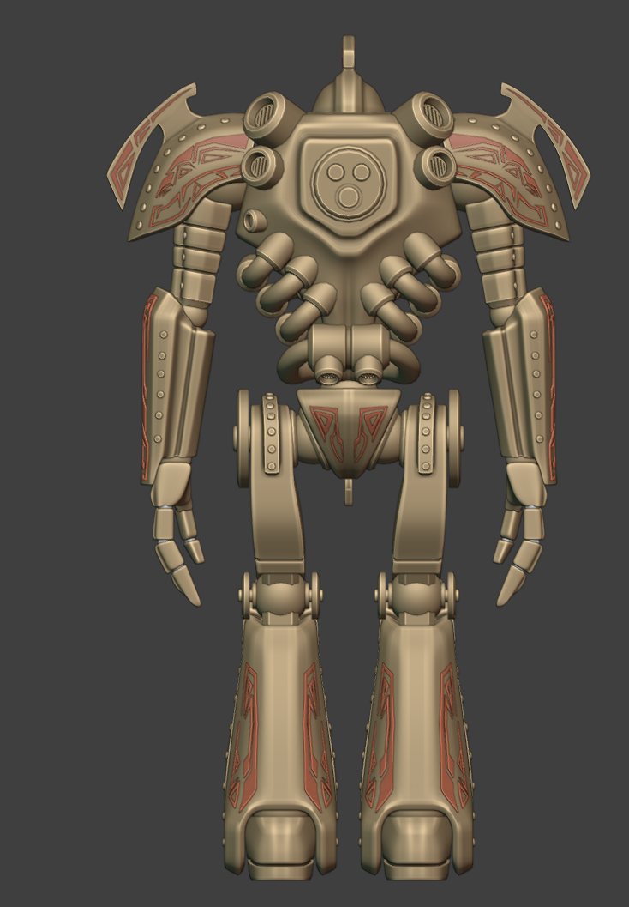
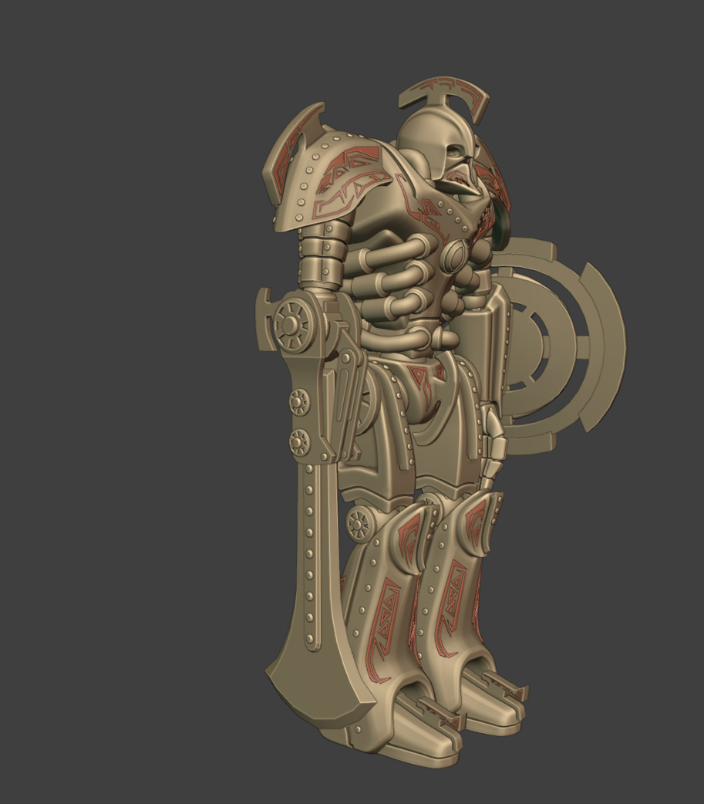
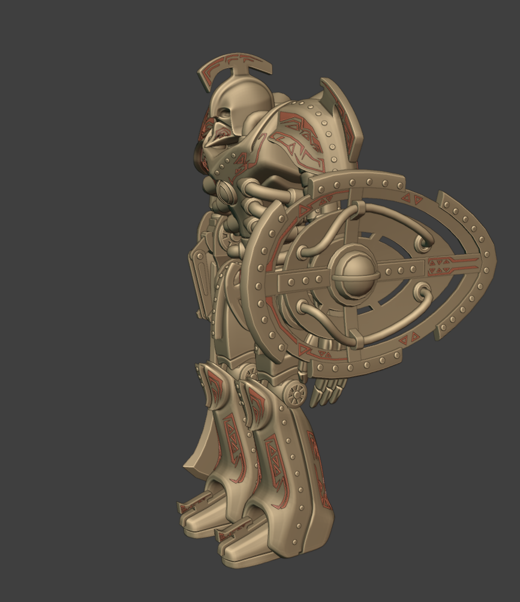
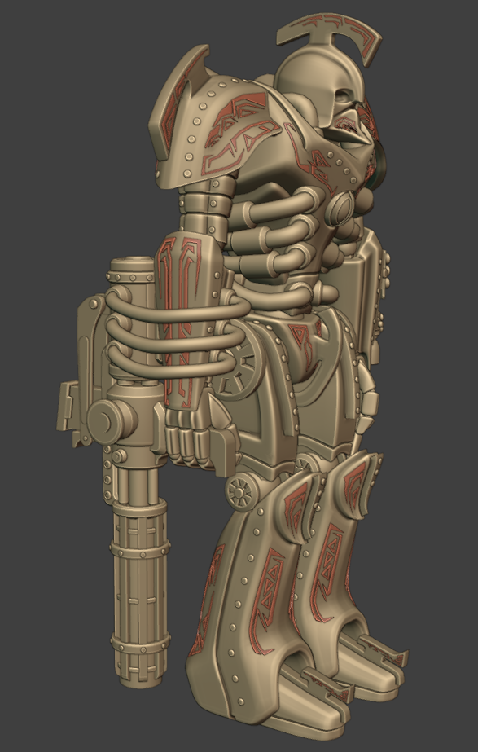
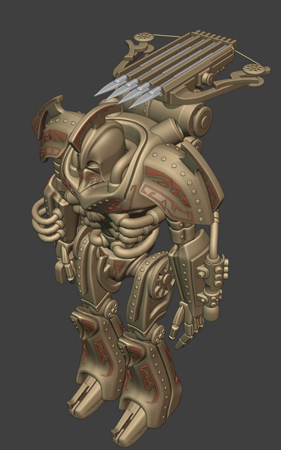
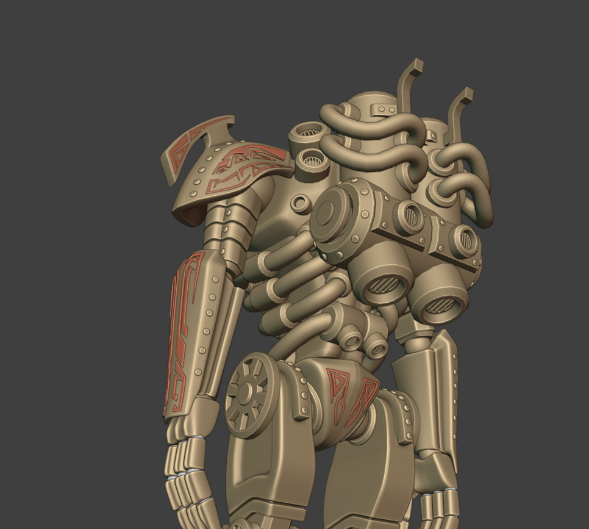

  

# Ashguard Meeting Notes — July 2026

*Hello everyone, and welcome to the July meeting, the second meeting of the slow-ass summer period. Raids have slowed down temporarily, but we have not stopped working on things.*

---

## SLMC News

Things have been slow all over the SLMC this month, as we would expect, but there were a few potentially exciting updates.

- **The Guild** have dropped the Badlands continent and replaced it with **"Bad Space"**, a one-sim neutral combat sim that they now reside on. They have cleaned it up a lot and are encouraging their take on partial damage there. It even has a Dunny's, if you are needing an Ash Yam Grand Slam in the mornings. It could be a decent bit of fun going forward, much like The Union once was for us with our weekly rumble.

- **The Alliance Navy** may have resurfaced, and if they are serious about coming back we will make every effort to help them in that endeavour. Our jokes about AN aside, they do believe in our philosophy of making the SLMC a fun, gamified experience.

- **Grave** might have rebranded again. It's not news, but I feel obligated to bring it up.

---

## Ashguard News

As this has been a slow month, there have been no real predicaments or changes to bring up. I expect the activity lull in the SLMC will continue through next month, though it does normally pick back up in August. But we do have releases.

---

## College of Artifice Update

### Dwemeri Katar

A dual-wielded fist melee, modelled by **Greiving** and scripted by **Soap**. They come with fast, short-range attacks and a little dash to close the gap for your quick strikes. They are wielded on Layer 2 and can be worn separately in either the left or right hand. Soap had to make entirely unique animations for these.

### Veloth's Telvanni Cannon

A charge-up raycast beam of magic, designed after its handheld siblings, intended as a stronger focused anti-armor weapon. It will be released for the Veloths. It is part of the ongoing Veloth project, and Soap would love some feedback on this one after you have put it through some real combat. It is now available.

### Ice Staff

**Skullphern** has been working on the Ice Staff, a Layer 3 addition to our magical arsenal. Skull can go into more detail, but it does exactly what you would imagine ice magic would.

### Dwemer Mech

The big project of the quarter. **Shiri** has been working on the group's first mech, and as this is our first foray into this kind of vehicle we wanted it to be distinct and visually iconic.

The design originally started close to the Tribunal ruins mech from Morrowind, but we could not achieve that exactly and still have it look cool rather than like a shitpost. It maintains some of that silhouette in the working of the model, and has come out as a genuinely unique Ashguard take on a centurion. I am quite pleased with its progress, and while it is still in the modelling stage, I wanted to share some previews.

The vehicle will have a lot of armament capability, with a back slot and changeable arms.

> **Note:** the red lines on the model are detailing to show the panel work. This is untextured work in progress.

*Front view of the base chassis.*

*Side profile.*

*Rear view.*

*One of the changeable arms: a heavy hafted melee option.*

*A large tonal disc mounted as an arm option.*

*A rotary cannon arm.*

*The back slot carrying a ballista mount.*

*Detail on the rear assembly and pipework.*

### Kunai

I had these made by **Greiving** and they are quite cute. They will work a lot like the throwing stars, and while I don't think they will ever be "meta", I hope we can make them a fun little gimmick.

---

## Lil Bits

### Occupy Bad Space

Ashguard needs members. I know everyone does their best, but creating a presence at Bad Space may help our image and get us seen by potential members across the SLMC. As I said at the start, the Guild have really cleaned the place up, and they have consistently been quick to adopt our ideas, such as vehicle timers and partial damage. **Objective merits will also be counted in operations there.**

I was going to add a whole thing on branding and hyping up the Ashguard, but I was too excited to talk about releases and updates this month.

### Mercurial Moved House

Mercurial moved house.

---

## Promotions

| Member     | Promotion |
| ---------- | --------- |
| Khalys     | E-2 → E-3 |
| Phanuealle | E-5 → E-6 |

---

## Merits

Merits will be delayed this month. It is currently a very lengthy task and I have had almost no time off work.

---

*And that is all for the July meeting. Thanks for coming, everyone!*

---
