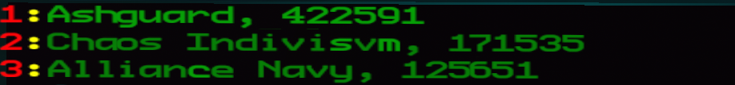
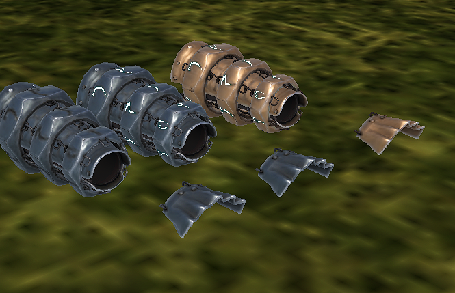
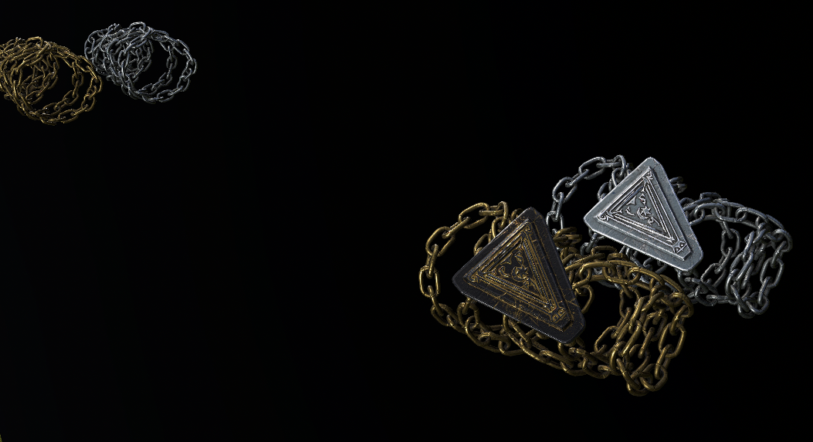
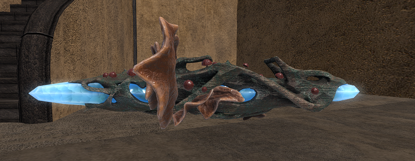
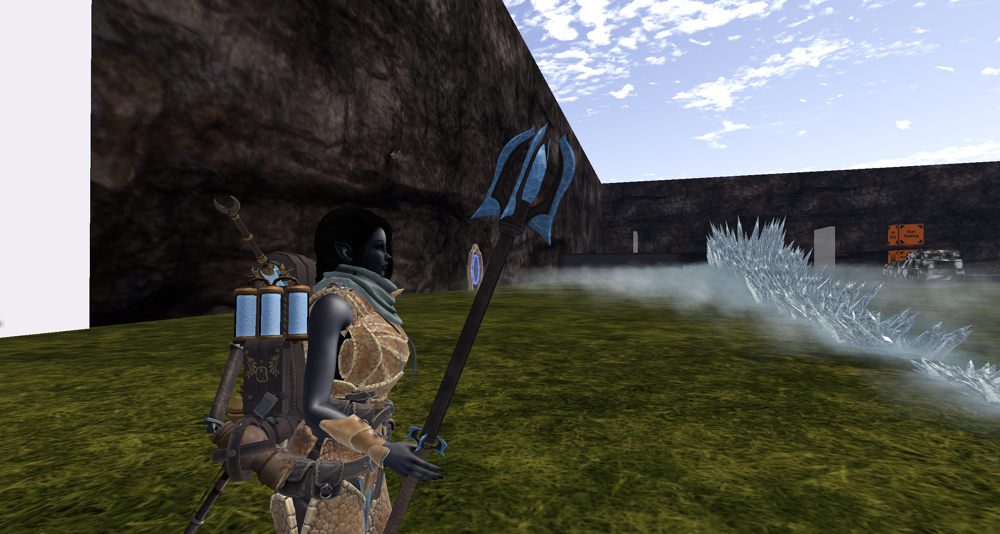
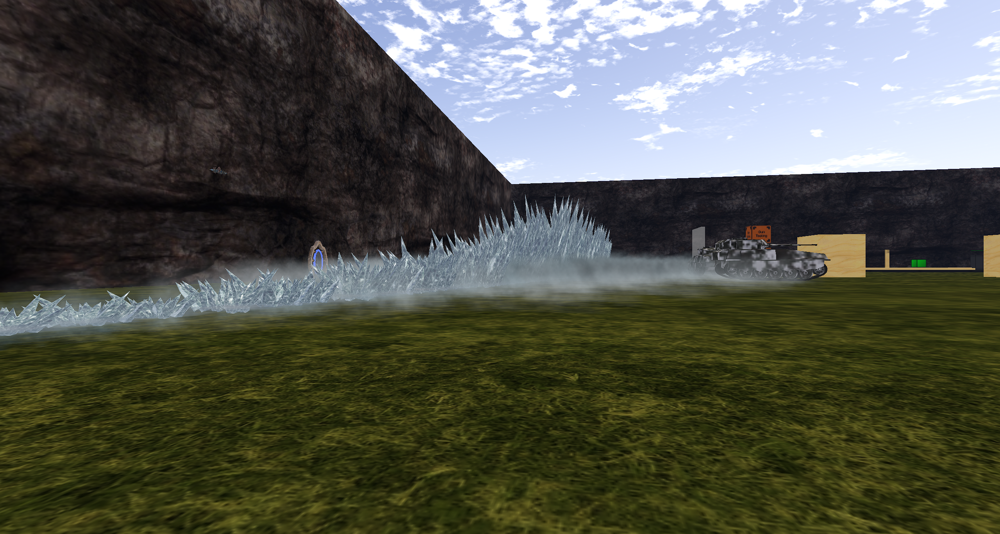

  

# Ashguard Meeting Notes — August 2026

*Hello everyone, and welcome to the August Ashguard meeting! It has been a very exciting month for us and I could not be prouder of us. However! We have a format to follow, so let's start things off with the SLMC news.*

---

## SLMC News

It is all obvious stuff this month, but it is nice to have the record from our perspective on the docs website so!

- **Alliance Navy** has returned under Jason Backer again. They have a sim which they have tied to the Badlands. I am not sure in what capacity their sim will be raidable as of yet, but hopefully we can find out soon if it is going to be a proper SLMC region or an extension of the Badlands.

- **Grave** has rethemed again, this time to Mithril. It is Metal Gear I think and he has also attached his region to the Badlands. As above, we just don't know with what capacity these regions will be raidable, but we can hope it is as normal standalone combat spaces and not just as part of the continent.

And that is about it except for:

- **Hellweek** happened and was an incredible week, with the majority of the community participating in some capacity. It also breathed a little life into the SLMC during a slow season.

Which I think transitions us brilliantly into the Ashguard news!

---

## Ashguard News

### Operation: Bad Space and Hellweek

Basically it's all Hellweek!

It is funny, because I had planned Operation: Bad Space with very little thought, as per our last meeting where I indicated that there is a chance that Bad Space might be a more refined combat sim. While we were wrong on that account, it has quickly grown into a 3 region arena again. We were quite lucky in that Wahler Whimsy had also been planning this Hellweek event with the GLC folks, so our operation was turned from possibly just being us occupying the sim to a full on almost full time combat extravaganza.

It was awesome. Ashguard turnout was massive and with frankly no effort on my part. You guys all turned up in shifts, taking over from one another which let us control the flags basically always. And thanks to the absolutely outstanding effort of everyone in the group we absolutely smashed it.

Here are the final scores for the top 3:

| Place | Group           |   Score |
| ----- | --------------- | ------: |
| 1     | Ashguard        | 422,591 |
| 2     | Chaos Indivisvm | 171,535 |
| 3     | Alliance Navy   | 125,651 |

*The final Hellweek scoreboard.*

We had a very difficult week, but we earned every point on that board. We were bombarded from space for the majority of the week, making our little sanctuary more of a hindrance than a boon. We were targeted by one of the finest marksmen in the SLMC for half of the week, and at many a time we were black screened by other combatants through the walls of our spawn.

The reason we won was not because we had a flag outside of our spawn, which in fairness! should not really have been there but mathematically doesn't really put much in for our win. We won because we had a goal and all of our members strived to earn it. We had no favour from the house. All we had was our commitment, Soulseeker repeaters. Quite a few katar and a fleetship spatula.

---

## Merits

So with Hellweek over and our first proper old fashioned operation concluded, we get the pleasure of rewarding you guys with some of those merit cosmetics we have been working so hard on. Switching up the meeting formula this month, let us move straight into the commendations.

As a group we had a combined 590 hours participating in the event. Wild. Anyway. Here we go.

### Besieger and Defender

Due to the sheer hours in combat, both defending and capturing flags, Besieger and Defender have been counted for this event.

| Tier       | Merit    | Recipients                                                                                                                                      |
| ---------- | -------- | ----------------------------------------------------------------------------------------------------------------------------------------------- |
| Apprentice | Besieger | Lemur Incognito, Ruqi, Leviathan Vortex                                                                                                         |
| Apprentice | Defender | Ruqi, Leviathan Vortex                                                                                                                          |
| Journeyman | Besieger | Kel Solstice, Vile Whisper, Gun Stratten, Sadistic Emerald, Mercurial Amethyst, Impish Rizzler, Fox Doji, Phanuealle Dust                       |
| Journeyman | Defender | Kel Solstice, Lemur Incognito, Vile Whisper, Adama900, Gun Stratten, Sadistic Emerald, Mercurial Amethyst, Impish Rizzler, Fox Doji, Skullphern |

> **Reward:** Journeyman Besiegers can pick up the Raider's Pauldron (Iron) in the armory, and Journeyman Defenders can pick up the Guardian's Pauldron (Steel).

### Pointman

Next up we have pointman. This is a merit that is awarded to those who capture objectives, but due to the SLMC landscape at the minute, objective builds basically don't exist. Well, Hellweek was ALL objectives!

| Tier       | Recipients                                  |
| ---------- | ------------------------------------------- |
| Apprentice | Ria Nightfall, Ritual Whisper               |
| Journeyman | Kel Solstice, Lemur Incognito, Khalys Ahren |

**Master Pointman**

|  # | Member             |  # | Member           |
| -: | ------------------ | -: | ---------------- |
|  1 | Skullphern         |  8 | Leviathan Vortex |
|  2 | Fox Doji           |  9 | Adama900         |
|  3 | Impish Rizzler     | 10 | Phanuealle Dust  |
|  4 | Mercurial Amethyst | 11 | Vile Whisper     |
|  5 | Soap Frenzy        | 12 | Orion Starchild  |
|  6 | Sadistic Emerald   | 13 | Ruqi             |
|  7 | Gun Stratten       | 14 | Error Icon       |

> **Reward:** Journeyman achievers can pick up the Ashstorm Dust Goggles in the armory. Masters can pick up that and their shiny Ashstorm Jingasa.

### Assassin

We also merited people rewards for kills based on time spent on the field. We are now able to more accurately track kills via the HUD, so in future this is a much easier merit to hand out, but we are confident that these assassins are deserving of their writs.

| Tier       | Recipients                    |
| ---------- | ----------------------------- |
| Apprentice | Kel Solstice, Lemur Incognito |

**Journeyman Assassin**

|  # | Member             |  # | Member           |
| -: | ------------------ | -: | ---------------- |
|  1 | Skullphern         |  7 | Gun Stratten     |
|  2 | Fox Doji           |  8 | Leviathan Vortex |
|  3 | Impish Rizzler     |  9 | Adama900         |
|  4 | Mercurial Amethyst | 10 | Phanuealle Dust  |
|  5 | Soap Frenzy        | 11 | Vile Whisper     |
|  6 | Sadistic Emerald   | 12 | Orion Starchild  |

> **Reward:** Journeymen can now pick up their Morag Tong 'Shadow Hood' in the armory.

### Pillar of the Ashguard

The next merit, Pillar of the Ashguard, we have given to those who spent more than two full days on the field during the week and really gave the contest their all. In fact SOME of us probably gave a little too much.

| Tier       | Recipients                                     |
| ---------- | ---------------------------------------------- |
| Apprentice | Fox Doji, Mercurial Amethyst, Sadistic Emerald |
| Journeyman | Skullphern                                     |

> **Reward:** the Ancestor Chainwrap. Skull, you can pick up dem chains in the armory.

### Specialist

Specialists! This merit is for those who perform really well in a niche role and are commended for it via OICs or officers. Because of the hectic nature of the week, this merit is leaning more on previous raids.

| Tier       | Member           | Citation                                              |
| ---------- | ---------------- | ----------------------------------------------------- |
| Apprentice | Sadistic Emerald | For excellent gardening.                              |
| Journeyman | Skullphern       | For Fleetship Flipping and also go to bed Skullphern. |
| Journeyman | Error Icon       | For Surgical Deletion of LBA.                         |

> **Reward:** Journeymen can pick up their Specialist's Rune Bracer in the armory.

### Smaller Merits

And now for our smaller merits before I move on to promotions. And finally, Nightwatchmen. Those who took the nightshift.

| Merit                 | Recipients                                                  |
| --------------------- | ----------------------------------------------------------- |
| Mark of the Artificer | Skullphern, Soap, Phan                                      |
| Mark of the Telvanni  | Skullphern                                                  |
| Mark of the Redoran   | Mercurial, Vile, Orion, Adama, Phan                         |
| Nightwatchman         | Skull, Soap, Levi, Error Icon, Gun Stratten, Adama900, Ruqi |

> The smaller merits, such as the Marks and Nightwatchman, do not currently have their merit rewards finished yet, but we are working on it. The same goes for the commander merit that OICs like Fox, Adama, myself and Mercurial would normally have achieved, that is not here yet either.

### Merit Cosmetic Rewards

A couple of the cosmetics being handed out this month, now that they are finished.

*The Specialist's Rune Bracer, with its variants.*

*The Ancestor Chainwrap, plain and with the service medallion hung from it.*

---

## Promotions

We will go through these much quicker this month, as we still have to do the artificers section and past me writing this presumes that my throat probably hurts about now.

| Member           | Promotion |
| ---------------- | --------- |
| Ruqi             | E-1 → E-2 |
| Wahler Whimsy    | E-1 → E-2 |
| Sadistic Emerald | E-4 → E-5 |
| Kel Solstice     | E-5 → E-6 |
| Vile Whisper     | E-6 → E-7 |
| Fox Doji         | E-7 → E-8 |

All much deserved.

---

## College of Artifice Update

There is not too much to say for artificery this month, since most of it was dedicated to Hellweek or to the merits and back end systems for those! But we do have a couple of releases, one of which was a vital part of Hellweek.

### Telvanni Heavy Cannon (Now Available)

The Telvanni Heavy is a Layer 3 raycast anti-LBA with 4 charged up shots that do 25 each. Honestly this is one of the most valuable pieces of kit we could have vs fast movers or hard to hit targets. It is available now for 900 motes.

*The Telvanni Heavy Cannon.*

### Ice Staff (Now Available)

The Ice Staff is also now released. It is a very cool crowd controlly weapon with awesome effects.

*The staff itself, Layer 3.*

*The ice wall going up across the field.*

---

*And that is all for the August meeting. Thanks for coming, everyone!*

